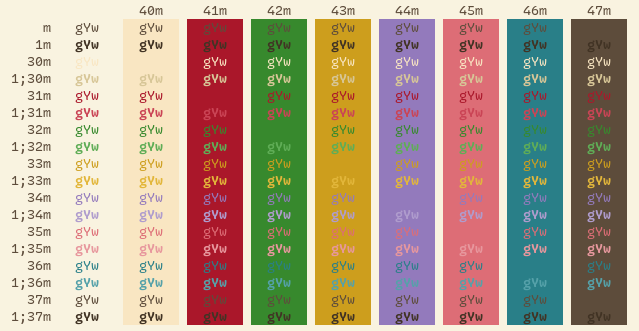
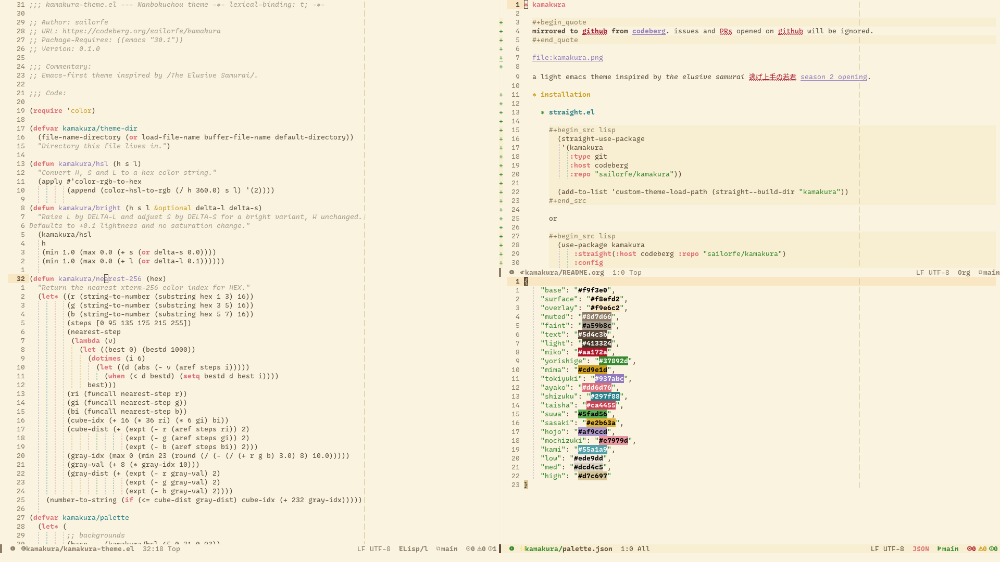

* kamakura

a light emacs theme inspired by /the elusive samurai 逃げ上手の若君/ [[https://www.youtube.com/watch?v=Dgj69Vqr120][season 2 opening]] with support for [[https://orgmode.org][org-mode]], [[https://github.com/jrblevin/markdown-mode][markdown-mode]], [[https://magit.vc/][magit]], [[https://github.com/minad/corfu][corfu]], and [[https://github.com/akermu/emacs-libvterm][vterm]].

** installation

*** =straight.el=

if you have =(straight-use-package-by-default)= set:

#+begin_src lisp
(use-package kamakura
    :straight(:host codeberg :repo "sailorfe/kamakura")
    :init
    (load-theme 'kamakura t)
#+end_src

or

#+begin_src lisp
(straight-use-package
'(kamakura
    :type git
    :host codeberg
    :repo "sailorfe/kamakura"))

(add-to-list 'custom-theme-load-path (straight--build-dir "kamakura"))

(load-theme 'kamakura t)
#+end_src

*** =package.el=

#+begin_src lisp
(use-package kamakura
    :vc (:url "https://codeberg.org/sailorfe/kamakura")
    :ensure t
    :config (load-theme 'kamakura t))
#+end_src

** extras

- [[https://codeberg.org/dnkl/foot][foot]]
- [[https://neovim.io][nvim]] 0.11
- shell
- [[https://termux.dev][termux]]
- tty
- vim 8 ([[https://vim-classic.org][vim-classic]])
- [[https://invisible-island.net/xterm/xterm.html][xterm]]
- [[https://pwmt.org/projects/zathura/][zathura]]

** contributing

#+begin_quote
*this repo is mirrored to github from [[https://codeberg.org/sailorfe/kamakura][codeberg]].* issues and PRs opened on github will be ignored.
#+end_quote

*** adding emacs packages

if you've extended kamakura with additional faces, especially for external packages, append them to [[file:kamakura-theme.el][kamakura-theme.el]] inside the =custom-theme-set-faces= list and open a pull request.

**** wishlist

- [ ] dogfood and extend magit as i rarely use it myself 🙏🏼

*** adding extras

external ports are automatically generated from templates using ={{variable}}= placeholders for keys that can be found in [[file:palette.json][palette.json]]. to contribute:

1. add a file to =templates/=.
2. edit =kamakura/export-targets= at the bottom of [[file:kamakura-theme.el][kamakura-theme.el]] to include a list like =("templates/INPUT-FILE" . "extras/$APP/OUTPUT-FILE")=.
3. run [[file:scripts/build][./scripts/build]] and [[file:scripts/test][./scripts/test]]. test your build directly in the target application and repeat as needed.
4. [[https://codeberg.org/sailorfe/kamakura/pulls][open a pull request]] committing your *template file*, *kamakura-theme.el* and *your new extra* with a commit message like =feat(extra): add $APP=.

** license

kamakura is released with [[https://unlicense.org][the unlicense]].
